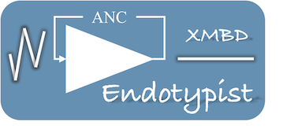
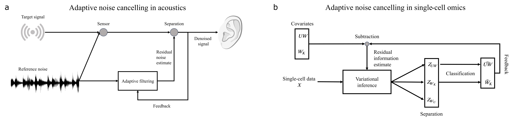

# 
 Endotypist<sup>XMBD</sup> introduces the concept of active noise control, which has achieved remarkable success in the field of acoustics, to the domain of single-cell omics. It employs an adaptive algorithm, implemented through deep random-effects modelling, to isolate signals originating from various sources.

The analogy between the adaptive noise cancelling model in acoustics and Endotypist<sup>XMBD</sup>:
 

## Citation
Feng Zeng, Xuwen Kong, Hengxiao Ni, Fan Yang, Ting Chen, Jiahuai Han. Advancing the detection of phenotype-associated cell subsets by applying an adaptive noise cancelling algorithm to single-cell omics. Submitted. 2023

## Installation
1. Install [pytorch](https://pytorch.org/get-started/locally/) according to your computational platform
2. Install dependencies:
    - `pip3 install numpy scipy pandas scikit-learn pyro-ppl matplotlib`

    - `pip install datatable`


## Tutorials

### Example 1: Negative control example
For more information, please refer to the [NeurIPS2021](./tutorial/nips2021_bmmc_donor1_shuffle_tutorial.ipynb) example.

### Example 2: Simulated case-control example
For more information, please refer to the [Case-Control simulation](./tutorial/simulated_case_control_tutorial.ipynb) example.

### Example 3: Infection endotype example
For more information, please refer to the [Endotype](./tutorial/Infection_endotype_tutorial.ipynb) example.


## Usage
Here is a simple command example for using Endotypist<sup>XMBD</sup>. Eetailed information about the parameters of Endotypist<sup>XMBD</sup> is provided below. 
```
usage: Endotypist.py [-h] [--cuda] [-n NUM_EPOCHS] [-bs BATCH_SIZE] [-lr LEARNING_RATE]
                  [--sup-data-file DATA_FILE] 
                  [--sup-condition-file DESIRED_COVARIATE_FILE]
                  [--sup-condition2-file UNWANTED_COVARIATE_FILE]
                  [-hl hidden_layer_size] [-zd latent_variable_size]
                  [--likelihood LIKELIHOOD]
                  [--condition-type DESIRED_COVARIATE_TYPE]
                  [--condition2-type UNWANTED_COVARIATE_TYPE]
                  [--save-model SAVE_MODEL]

example run: 
python Endotypist.py --sup-data-file <data_file> 
                     --sup-condition-file <desired_covariate_file>
                     --sup-condition2-file <unwanted_covariate_file> 
                     --cuda -lr 0.001 -bs 1000 -n 300
                     -hl 500 -zd 200
                     --condition-type onehot
                     --condition2-type onehot
                     --save-model best_model.pth

```


## Running mode

Endotypist<sup>XMBD</sup> offers two distinct operational modes. The first is the unsuprevised mode, which does not require cell type annotations. In this mode, Endotypist<sup>XMBD</sup> autonomously identifies putative cell states using the residual space. The second is the supervised mode, allowing users to provide cell type annotations to Endotypist<sup>XMBD</sup> through the parameter `--sup-label-file`.

Users can specify the type of phenotype variable by setting `--label-type`, `--condition-type`, `--condition2-type`.


## Parameters about likelihood and zero-inflation modelling 
Endotypist<sup>XMBD</sup> provides users with the flexibility to choose from various likelihood functions, including negbinomial (stand as negative binomial), poisson, and multinomial, by specifying  the parameter `--likelihood`. The defualt likelihood is negbinomial. 

By default, Endotypist<sup>XMBD</sup> employs zero-inflation modelling. Users have the option to disable the zero-inflation modelling by using the parameter `--zero-inflation none`.

## Parameters about desired and unwanted covariates
In Endotypist<sup>XMBD</sup>, users can provide information about desired and unwanted variations using separate files specified by the parameters `--sup-condition-file` and `--sup-condition2-file`, respectively. 

Endotypist<sup>XMBD</sup> offers support for various encoding formats for both desired and unwanted covariates. These formats include onehot, categorical, compositional, rate, real, discrete, which can selected using the paramters `--condition-type` and `--condition2-type`.

The default encoding format is onehot. 

## Parameters about network settings
In Endotypist<sup>XMBD</sup>, the neural network structures are defined by a set of parameters, including:
1. `--hidden-layers:` The parameter defines the sizes of the hidden layers and can take either a scalar value or a list.
2. `--z-dim:` This parameter determines the dimensionality of the latent variables and should be set as a scalar value.
3. `--hidden-layer-activation:` This parameter specifies the activation function for the hidden neurons. Options include relu, softplus, leakyrelu, linear. The default is relu. 
4. `--post-layer-function:` This parameter designates the function applied after the neural network activation. Options include dropout, layernorm, batchnorm, or various combinations of these functions. The default configuration is 'dropout layernorm'.

